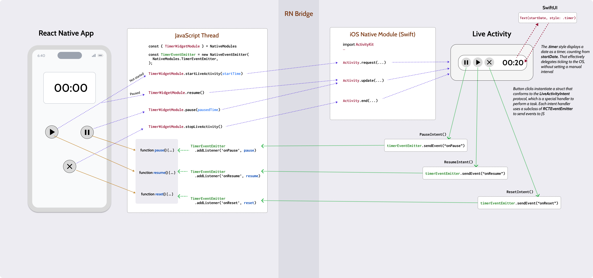

# Timer Live Activity

Example project designed to demonstrate the **seamless integration between a React Native application and an iOS Live Activity**. 
For a comprehensive guide that walks you through each step, check out this detailed walkthrough at: **https://www.reactnative.university/blog/live-activities-native-module**

## What this project covers

- 🍏 **Swift Native Modules**: Learn how to craft the essential bridging files, enabling the use of Swift, the leading-edge iOS programming language, in your Native Modules.
- 🚀 **Live Activity API**: Discover how to initiate, update, and terminate an iOS Live Activity directly from React Native, bringing content to both your phone's dynamic island and lock screen.
- 🖌️ **SwiftUI**: Delve into the SwiftUI framework, exploring its declarative composition model that simplifies UI development with a cleaner, more concise syntax.
- 🔌 **Bidirectional Communication**: Uncover the power of invoking React Native code through user interactions within the live activity, enabling a two-way communication stream.

https://github.com/rgommezz/timer-live-activity/assets/4982414/65aea563-0618-450a-b37c-812baec3b6b0

## Architecture

## Getting Started

1. Clone the repository
2. Run `npm install` to install the dependencies
3. Run `npx pod-install` to install the Pods for the iOS project
4. Run `npm run ios` to start the application
